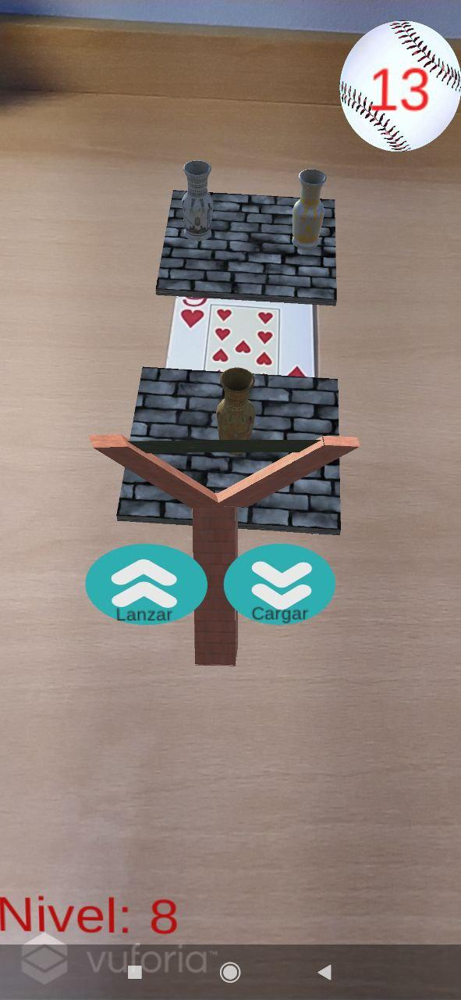
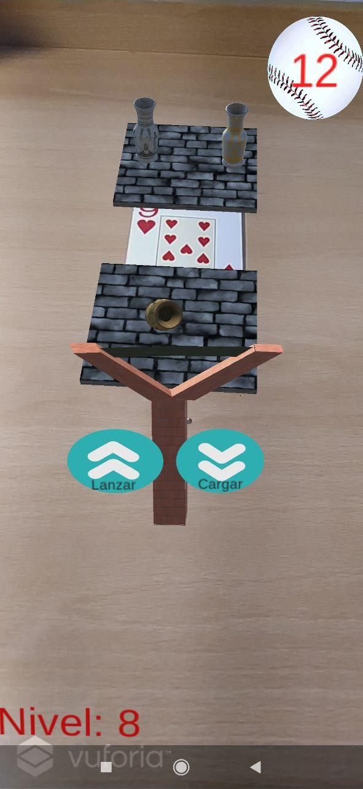

# SlingShotAR
Proyecto final de la asignatura Computación Ubicua e Inteligencia Ambiental (CUIA), realizado junto a [David Armenteros Soto].

SlingShotAR es una aplicación móvil desarollada en Unity que utiliza técnicas de realidad aumentada aplicadas al tradicional juego del tirachinas. La jugabilidad consiste en ir avanzando niveles de creciente dificultad en los que se deberá derribar los diferentes objetos que se situén en la escena, como por ejemplo jarrones, cajas, barriles, etc. Inicialmente se dispondrá de 10 lanzamientos, número el cual aumentará cuando logremos superar los niveles, y en caso de llegar a 0 se finalizará la partida. También, nuestra aplicación dispondrá de un menú, desde el cual podremos modificar el brillo de la pantalla y el volumen de la música del juego, que será acorde a la dificultad del nivel en el que nos encontremos.

  
  

[David Armenteros Soto]: https://github.com/davidArSo
